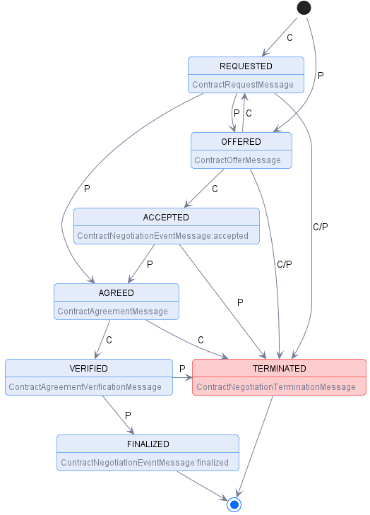

## [Contract Negotiation](https://docs.internationaldataspaces.org/ids-knowledgebase/v/dataspace-protocol/contract-negotiation/contract.negotiation.protocol)

### Definition

A Contract Negotiation (CN) involves two parties, a Provider that offers one or more Datasets under a usage contract and Consumer that requests Datasets.
A CN is uniquely identified through an IRI. Each CN requires a newly generated IRI, which may not be used in a CN after a terminal state has been reached.
A CN progresses through a series of states, which are tracked by the Provider and Consumer using messages.
A CN transitions to a state in response to an acknowledged message from the counter-party.
Both parties have the same state of the CN. In case the states differ, the CN is terminated and a new CN has to be initiated.

### States

The CN states are:

* **REQUESTED**: A contract for a Dataset has been requested by the Consumer based on an Offer and the Provider has sent an ACK response.
* **OFFERED**: The Provider has sent an Offer to the Consumer and the Consumer has sent an ACK response.
* **ACCEPTED**: The Consumer has accepted the latest Offer and the Provider has sent an ACK response.
* **AGREED**: The Provider has accepted the latest Offer, sent an Agreement to the Consumer, and the Consumer has sent an ACK response.
* **VERIFIED**: The Consumer has sent an Agreement verification to the Provider and the Provider has sent an ACK response.
* **FINALIZED**: The Provider has sent a finalization message including his own Agreement verification to the Consumer and the Consumer has sent an ACK response. Data is now available to the Consumer.
* **TERMINATED**: The Provider or Consumer has placed the CN in a terminated state. A termination message has been sent by either of the Participants and the other has sent an ACK response. This is a terminal state.

### State Machine

The CN state machine is represented in the following diagram:

Transitions marked with C indicate a message sent by the Consumer, transitions marked with P indicate a Provider message.
Terminal states are final; the state machine may not transition to another state.
A new CN may be initiated if, for instance, the CN entered the TERMINATED state due to a network issue.