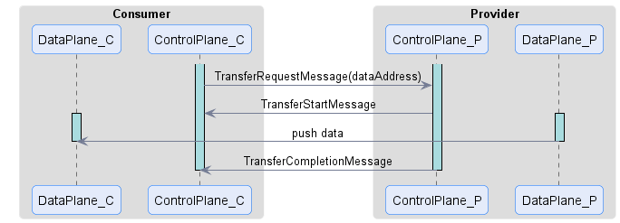
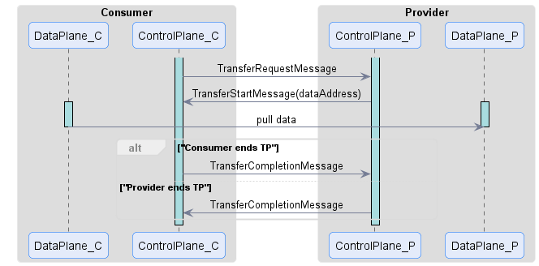
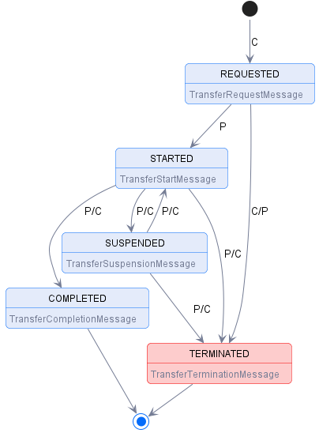

## [Transfer Process](https://docs.internationaldataspaces.org/ids-knowledgebase/v/dataspace-protocol/transfer-process/transfer.process.protocol)

### Definition

A Transfer Process (TP) involves two parties, a Provider that offers one or more Datasets under a Usage Policy and a Consumer that requests Datasets. 
A TP progresses through a series of states, which are controlled by the Provider and Consumer using messages. 
A TP transitions to another state as a result of an exchanged message.

### Prerequisites

To put the document into the right context, some non-normative descriptions of the core concepts follow in this subsection.

* **Control and Data Planes** 
  A TP involves two logical constructs, a control plane and a data plane. Serving as a coordinating layer, services on the control plane 
  receive messages and manage the local state of the TP (same as for the Catalog Protocol and the Contract Negotiation Protocol). 
  On the data plane, the actual transfer of data takes place using a wire protocol. 
  Both participants in a data sharing scenario run services logically regarded as control and/or data plane services. 
  The specification of data plane interfaces and interaction patterns are not in scope of this document.
* **Data Transfer Types** 
  Dataset transfers are characterized as push or pull transfers and it's data is either finite or non-finite. 
  This section describes the difference between these types.

**Push Transfer**

A push transfer is when the Provider's data plane initiates sending data to a Consumer endpoint. 
For example, after the Consumer has issued a Transfer Request Message, the Provider begins data transmission to an 
endpoint specified by the Consumer using an agreed-upon wire protocol.

_Note that the illustration of the sequence is only exemplary. The activation of actors is not determined, also, responses, 
parameters, possible recursions, and interactions between the components of one participant are not shown._

**Pull Transfer**

A pull transfer is when the Consumer's data plane initiates retrieval of data from a Provider endpoint. For example, after the 
Provider has issued a Transfer Start Message, the Consumer can request the data from the Provider-specified endpoint.

_Note that the illustration of the sequence is only exemplary. The activation of actors is not determined, also, responses, 
parameters, possible recursions, and interactions between the components of one participant are not shown._

**Finite and Non-Finite Data**

Data may be finite or non-finite. This applies to either push and pull transfers. Finite data is data that is defined by a finite set, 
for example, machine learning data or images. After finite data transmission has finished, the TP is completed. 
Non-finite data is data that is defined by an infinite set or has no specified end, for example, streams or an API endpoint. 
With non-finite data, a TP will continue indefinitely until either the Consumer or Provider explicitly terminates the transmission.

### States

The TP states are:

* **REQUESTED**: A Dataset has been requested under an Agreement by the Consumer and the Provider has sent an ACK response.
* **STARTED**: The Dataset is available for access by the Consumer or the Provider has begun pushing the data to the Consumer endpoint.
* **COMPLETED**: The transfer has been completed by either the Consumer or the Provider.
* **SUSPENDED**: The transfer has been suspended by the Consumer or the Provider.
* **TERMINATED**: The Transfer Process has been terminated by the Consumer or the Provider.

### State Machine

The TP state machine is represented in the following diagram:

Transitions marked with C indicate a message sent by the Consumer, transitions marked with P indicate a Provider message. 
Terminal states are final; the state machine may not transition to another state.